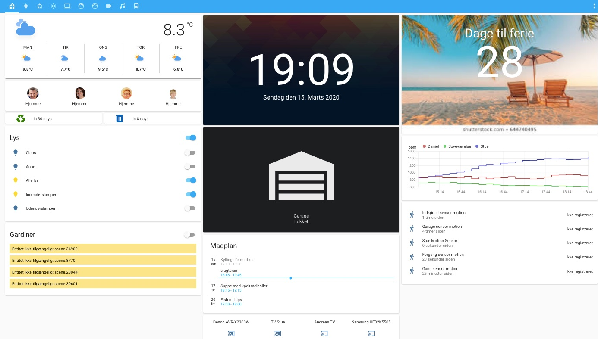
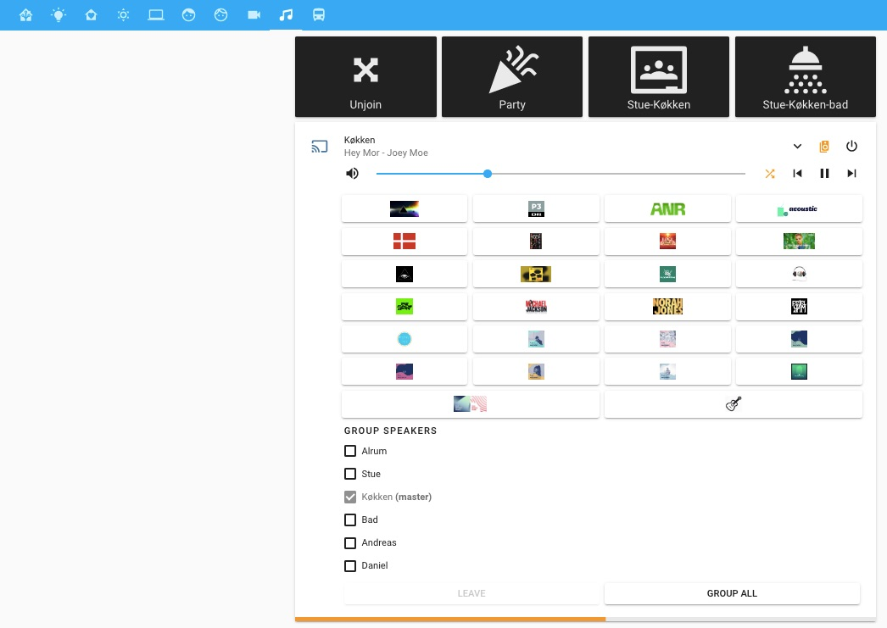

<!-- ![ha-version-shield] ![maintained] -->

# Home automation

**Devices I'm using:**
* Homeassistant Version 0.106.6 runs on a Mac Mini (2011'ish) running MacOs High Sierra
  + Installed [Python version 3.8.1](https://www.python.org/downloads/mac-osx/)
  + Followed the instructions to [install HomeAssistant on MacOs](https://www.home-assistant.io/docs/installation/macos/)
  + To upgrade HomeAssistant, I follow [these instructions](https://www.home-assistant.io/docs/installation/virtualenv/#upgrading-home-assistant)
* using Duckdns with dehydrated using [these instructions](https://www.splitbrain.org/blog/2017-08/10-homeassistant_duckdns_letsencrypt). I have fixed IP address and have forwarded port 8123, 80 and 443 in my router. I guess it would be wise to study [this description](https://community.home-assistant.io/t/duckdns-its-not-just-me-its-you/131586).
* Philips Hue - several bulps and a smart plug
* Sonos - several Play:1, Play:5, Connect, Connect:amp. A sonos One with Google assistant
* Using [Hue Dimmer for controlling Sonos](https://github.com/ClausDethlefsen/Home-AssistantConfig/blob/master/include/automations/anne.yaml)
* [Sonoff Basic - not flashed](https://www.youtube.com/watch?v=DsTqOlrQQ1k)
* Denon AVR receiver
* Some Samsung TVs
* Netatmo weather station with some extra indoor modules and the rain module
* Gogogate2 for the garage cover
* A number of iphones
* Tile
* synology NAS
* Apple TV4
* Hunter-Douglas curtains (currently [not working](https://github.com/home-assistant/core/issues/32324))
* Foscam camera
* Plex
* A nice [mini-media-player](mini-media-player) for controlling Sonos

## screenshots

<a href="https://www.buymeacoffee.com/Bwl9psu" target="_blank">Buy me a coffe, </a>if you like.

